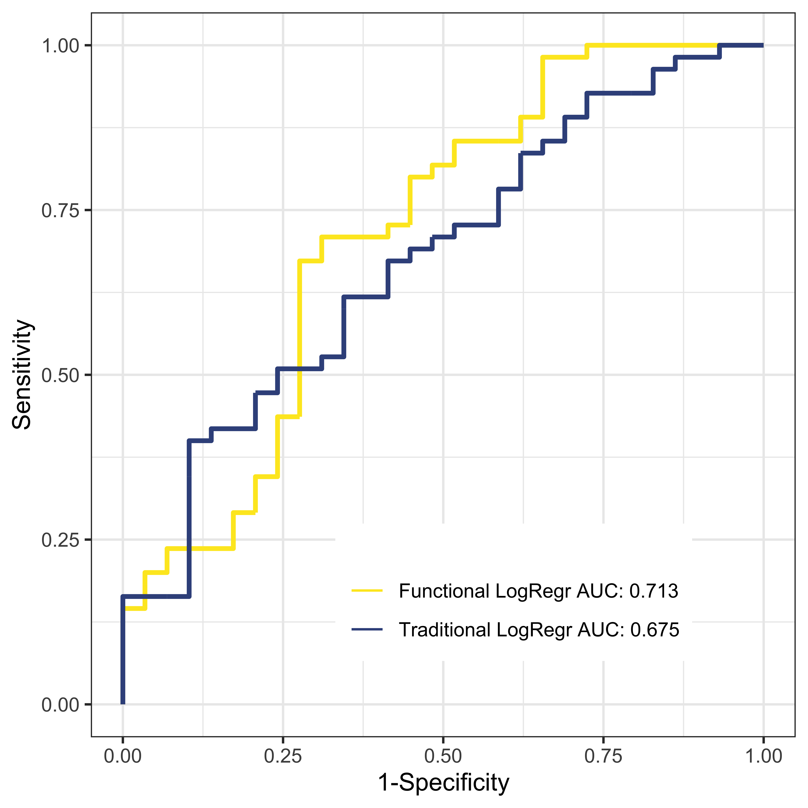
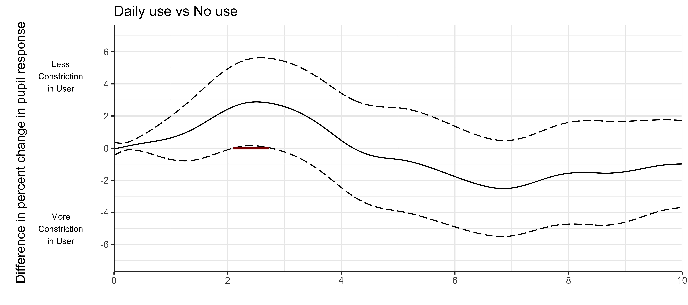

# Background
Pupil size reflex to a light test is a potential test to determine if a person is under the influence of THC and can be used as a field sobriety measure. For this analysis we'll be using methods from a statistical area called functional data analysis (FDA) which allows us to model the entire trajectory of the pupil reflex for each subject and discern differences between groups in the trajectories and in specific areas of the trajectory. This is in contrast to more traditional techniques which require extracting single summary measures such as the point of minimal constriction.  

## What is Functional Data Analysis? 

Functional Data analysis (FDA) is a field of statistics that models curves or trajectories of information without extracting pre-defined specific features. It allows us examine the sources of variation of these curves (fPCA), how differences in the patterns of the curves relate to an outcome, and how the patterns of the curves differ based on individual characteristics.   

## Data summary
Full pupil trajectories of pupil size during light reflex test. Pupil size was extracted at the image level based on image analysis techniques (Ben Steinhart's video segmentation pipeline). Each test was performed simultaneously on right and left eye before and after THC use (smoking).

+ Outcome: percent change from baseline
+ Start at frame 0 
+ End of test is not strictly defined (with FoS we shouldn't need to define the end of the test)
+ **Analysis to focus on data from second assessment (after THC use for smokers) of right eye**


## Summary of Findings -- POST data
+ Functional principal components analysis (fPCA) 
  + point of minimal constriction and rebound shapes drive the first and second PCs 
+ Prediction Analysis (ROC)with PCs, scalar features or a scalar-on-function regression model (SoFR)
  + Limited ability to separate groups with highest AUC for SoFR models (0.68-0.71)
  + No statistically difference between models with different feature types
+ BMI associated with PC2 from fPCA analysis
+ Function on Scalar Regression (FoSR)
  + Significant differences between Occasional and non-Users in the minimal constriction interval
  + Significant differences between Smokers and non-Smokers in the minimal constriction interval
  + New models including Post Consumption time to test (PCTT) for smokers show similar trajectories but with longer PCTT associated with a stronger minimal constriction
+ VAS (feeling high)
  + Odd associations in pre- and post- data for occasional users show "feeling higher" correlates with a stronger minimal constriction. Need clarification ?  


```{r setup, include=FALSE}
knitr::opts_chunk$set(echo = TRUE)
library(openxlsx)
library(ggplot2)
library(table1)
library(refund)
library(refund.shiny)
library(pROC)
library(stringr)
library(PerformanceAnalytics)
library(mgcv)
library(grid)
library(gridExtra)

# ps_folder <- "C:/Repositories/Dissertation/PupilSize_img"
# data_folder <- "C:/Users/Suneeta/OneDrive - The University of Colorado Denver/FDA/Data" # Home laptop
data_folder <- "C:/Users/godbolsu/OneDrive - The University of Colorado Denver/FDA/Data" # Work laptop
# data_folder <- "C:/Users/godbolsu/OneDrive - The University of Colorado Denver/FDA/Data"
ps_folder <- "202208_PupilLightReflex"
```


```{r dataReadIn, echo=FALSE}
right_0.post <- readRDS(file.path(data_folder, ps_folder,
                                "PupilLightReflex_POST_rightEye_20221208.rds"))

right_0.pt <-  readRDS(file.path(data_folder, ps_folder,
                                "PupilLightReflex_WPD_rightEye_20221208.rds"))

pt.analytic.df <- readRDS(file.path(data_folder, ps_folder,
                                "PupilLightReflex_PtData_20221208.rds"))

```

# Exploratory Analysis

Plot of PRE/POST for Right Eye

We'd examined the plot for the left and right eye and found them to be similar, so for this analysis we'll used data from the right eye.


There was some attenuation of the initial light reflex response between pre and post measures in most participants, but there is a lot of variability in the recovery trajectories (both duration and shape). We'll be exploring if these differences are significantly related to the participant's THC use category and if there might be differences by smoker vs non-smoker.


Most participant's are missing data after frame 400.


## Analytic Sample

There were 84 participants with both pre and post data which constituted the analytic sample. 

```{r tab1, echo = F}
table1(~demo_age + demo_weight+ demo_height+BMI + demo_gender + thc_chg + postConsumpTimeToTest + Post_PreTime + min_constriction_chg + AUC_chg + duration_chg + slope_chg + avg_end_percent_chg +vas1_high_score + vas_high_score_chg + vas1_score_dc + vas_score_dc_chg|user_cat, 
       data = pt.analytic.df)
```

## Post Data and Trajectories 

```{r postPlot, echo = F, warning=FALSE, fig.height = 6, fig.width = 10}
post_traj <- ggplot(right_0.post, aes(x=frame/30, y = percent_change, group = subject_id))+
             geom_line(show.legend = FALSE, alpha = 0.5)+
             facet_grid(rows = vars(user_cat.x))+
             labs(title ="POST Data Percent Change by THC", 
                  y = "Percent Change", 
                  x = "seconds")+
             theme_bw()

post_traj
```

Post Data: 

+ Lots of heterogeneity in the post profiles
+ Seemly like there's more variability in the recovery period for daily user (long duration)

```{r getLegend, echo = F}
g_legend<-function(a.gplot){
  tmp <- ggplot_gtable(ggplot_build(a.gplot))
  leg <- which(sapply(tmp$grobs, function(x) x$name) == "guide-box")
  legend <- tmp$grobs[[leg]]
  return(legend)}
```

# Analysis

## functional Principal Components Analysis (fPCA)
Similar to PCA, fPCA is a method to quantify the sources of variation in the data. With fPCA, we're finding functions or "shapes" that describe variation. 


### fPCA post data
Truncating to frame 400


For the post data: 

+ PC1 seems to show variation in the minimal constriction value. Participants with high loading (+2SD) on PC1 would have a less constriction while participants with a low loading (-2SD) would have a more constriction than an average individual. 

+ PC2 seems to show differences in the the overall shape of the trajectory and the pattern of recovery. High loading indicates a less than average constriction and slow recovery over time (and a double dip), while a low loading indicates more than average constriction and marked recovery over the test period.

## Prediction Analysis: Smoker vs non-Smoker

Using the PC scores from the fPCA analysis, scalar features and a scalar-on-function (SoFR) regression model in separate logistic regression models, we attempted to classify smokers and non-smokers. A SoFR model, uses the whole pupil change trajectory to model a scalar outcome (e.g. smoker or non-smoker) and fitted values from the SoFR model were used in the logistic regression predictive model. The SoFR model had the best prediction using an area-under-the-curve (AUC) metric; however these AUCs are not statistically significantly different. 



### Scalar on Function Regression (SoFR)
Scalar on Function Regression (SoFR) is a regression method that regresses a scalar value (eg. smoking status) on the full trajectory of the pupil light reflex (e.g. function). This analysis allows us to examine smoking status with differences in trajectories.  

## Association with Demographic Variables

Demographic Variables:

+ Age
+ Weight
+ Height
+ BMI 
+ Change in THC
+ Time from consumption to Post test
+ Sex

Results: 

Regression models regressed demographic variables on the 4 PCs for the post data. 

+ BMI negatively associated with PC2 adjusting for other PCs (p= 0.03)


## Function on Scalar Regression (FoSR)
Function on Scalar Regression (FoSR) is a regression method that regresses the full trajectory of the pupil light reflex (e.g. function) on set of scalar predictor, in this case THC user category and accounts for the between subject variability with a random effect term. This analysis allows us to examine differences in trajectories or parts of the trajectory by THC user group.   

### Differences by User Category





### Differences by Smoking Status


## Post Consumption Time to Test (PCTT)

To examine the effect of post consumption time to test (PCTT) on the pupil trajectories, we fit a model in smokers and non-smokers with an interaction term for PCTT in smokers. 


Additionally, using only smokers we fit an interaction model with PCTT and pupil trajectories. 


We need to explore allowing the shape of the trajectories to vary by PCTT and time using a joint functional models for these two variables. 

## VAS -- Feeling High

The VAS score was used to assess "feeling high" in smokers after THC consumption. In this analysis we are interested in examining differences in pupil trajectories with different values of "feeling high". Initially the VAS score was dichotomized to create a group of "High" vs "not high" participants, and a FoSR model was used to evaluate trajectories in these groups. 


Unexpectedly, as seen in the plot, user that felt more high had a stronger minimal constriction, so we decided to examine the scalar feature of minimal constriction along with user category in the for both pre- and post- time points and difference between them, as shown in the following series of plots.


In these plots we see a odd negative correlation in occasional users, with a higher VAS score associated with a stronger minimal constriction. 

We'd appreciate any input on whether there is a biological mechanism in action to account for this correlation or if it might be due to random chance (our current understanding). 
